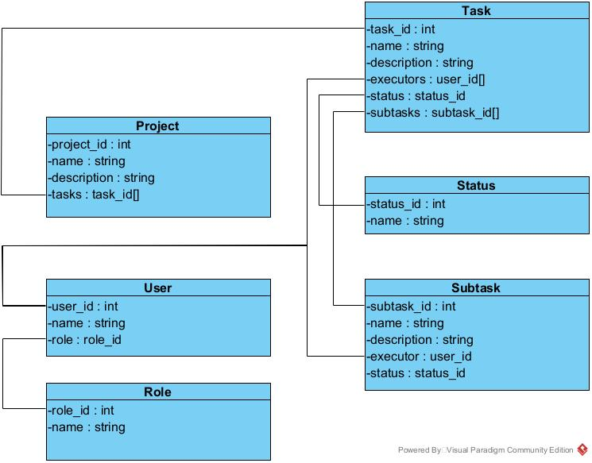

# System Design

**Task manager's architecture**

## Monolithic or Microservice architecture???

### Comparative characteristics

Characteristic | Monolithic | Microservice
--- | --- | ---
Language | Every service can be use any language | Single programming language
Code base | It has multiple code base | single code base
Troubleshooting | All services are independent and isolated from each other | Any kind of incorrect behavior in any of the components can seriously affect the operation of the entire application
Development and deployment | The development, deployment, operation and scaling of each component of the Microservices application are independent. Any update in any services of the application will not affect other services | Its codebases are large and its components are interdependent. This leads to a limitation of continuous deployment and development, because to update any component, you need to re-deploy the full application
Application scaling | All services are built like different modules | Application scaling is hard task cause the architecture is a single whole

Monolithic architecture is preferred for the development of very small, 
simple and lightweight applications, while a microservice for large and complex

**Due to the fact that we want a lightweight and unloaded task manager, we believe that we need to use monolithic architecture**

## What should do backend

Backend have to connect and use database, 
make connection with telegram by webhooks and also must
connect with github.

The backend also sends all the data to the frontend, and the last will draw user interface. 
Also, frontend can be used for changing, adding tasks 

For MVP backend should not use sockets, because we need to make our project fastly.
For the first time updates on the site can be caused by page reload. In a good way, we need websockets for interactive updating, but
we can use routes to get request. It can help to update data.

## About databases

There are user's, telegram's, github's, tasks', projects's and etc.
databases

In the application, each object will be an arbitrary structure. Therefore, we consider it appropriate to use mongodbB

We will use MongoDB. WHY?

+ MongoDB is easier for realisation than another DBs (we have some experience for it)
+ Our database will have little load. MongoDB will be enough for our tasks
+ MongoDB is the best choice for MVP, but later we can change DB for more optimal if necessary

## Database architecture

All entities contain the id and name fields. Some of them may contain description 

### Project

Project may contain tasks. Any project can have from 0 to infinity tasks.

+ tasks - array of task_id from Task

### Task 

Task contains executors, status and may contains subtasks

+ executors - array of user_id from User. There are as many as we want executors for the Task (?)

+ status - status_id from Status. Status can be "ToDo", "InProgress", "Done"

+ subTasks - array of subtask_id from Subtask. Any Task can have from 0 to infinity subtasks

### Subtask

The same structure as the Task, but doesn't contain field subtasks and instead of field executors 
Subtask contains field executor which isn't an array.

+ executor - user_id from User. There is only one executor for the subtask (?)

### User

User contains role

+ role - role_id from Role. User can be developer, project manager etc.

### Role and Status

These entities are something like Enumeration. 
For example, Status contains only 3, at first, values: ToDo, InProgress, Done.

## Only web panel user need?

User needs only web panel to change and make tasks.
But user may see tasks and projects on phone by connection with telegram.
In this case, mobile app is optional, like a desktop app, especially
some features
